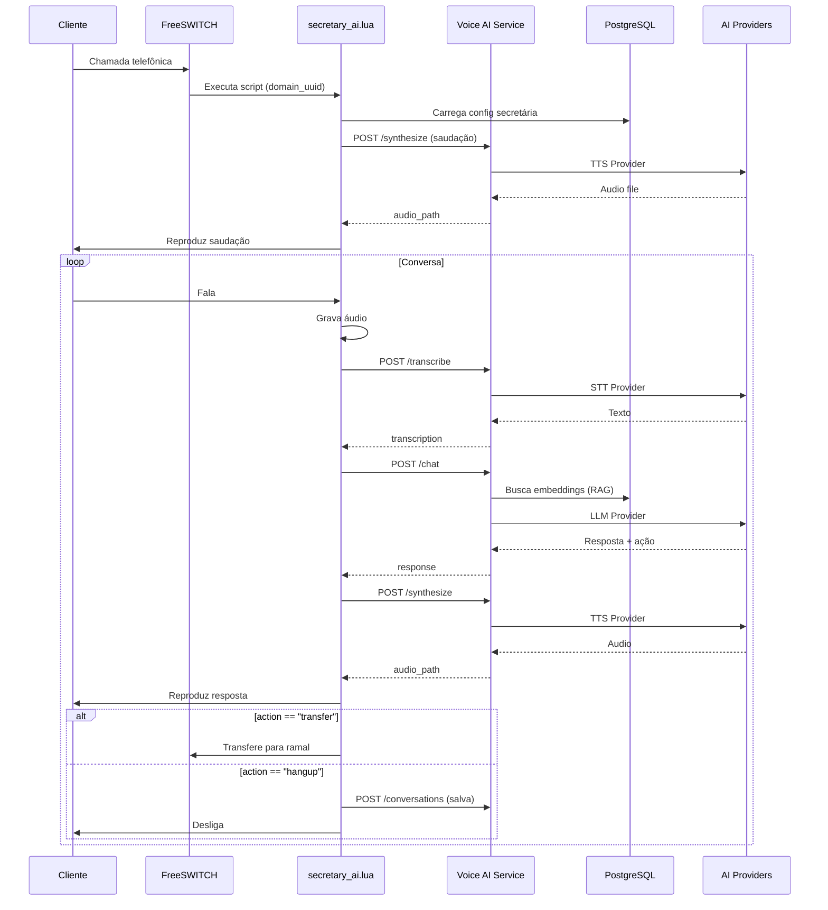
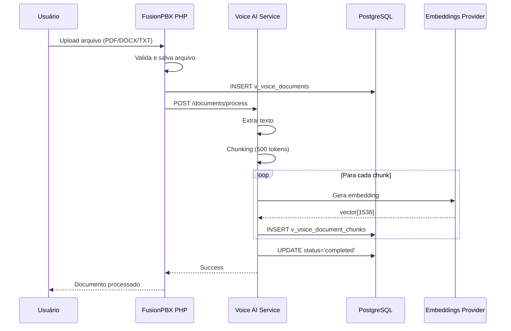
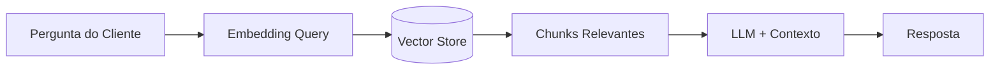

# Data Flow - Voice AI IVR

## Fluxo Principal: Chamada Telefônica



## Fluxo de Upload de Documento



## Fluxo de Busca RAG



**Detalhes:**
1. Pergunta do cliente é transformada em embedding
2. Busca vetorial (cosine similarity) encontra top-k chunks
3. Chunks com score > 0.5 são incluídos no contexto
4. LLM recebe: system_prompt + RAG_context + histórico + pergunta

## Estrutura de Dados

### Tabelas PostgreSQL

```
v_voice_ai_providers
├── provider_uuid (PK)
├── domain_uuid (FK) ──────┐
├── provider_type          │
├── provider_name          │
└── config (JSONB)         │
                           │
v_voice_secretaries        │
├── voice_secretary_uuid   │
├── domain_uuid (FK) ──────┤
├── stt_provider_uuid (FK) │
├── tts_provider_uuid (FK) │
├── llm_provider_uuid (FK) │
└── system_prompt          │
                           │
v_voice_documents          │
├── document_uuid          │
├── domain_uuid (FK) ──────┤
├── file_path              │
└── processing_status      │
                           │
v_voice_document_chunks    │
├── chunk_uuid             │
├── domain_uuid (FK) ──────┤
├── document_uuid (FK)     │
├── content                │
└── embedding (vector)     │
                           │
v_voice_conversations      │
├── conversation_uuid      │
├── domain_uuid (FK) ──────┤
├── caller_id              │
└── final_action           │
                           │
v_voice_messages           │
├── message_uuid           │
├── domain_uuid (FK) ──────┘
├── conversation_uuid (FK)
├── role (user/assistant)
└── content
```

## Integrações Externas

### AI Providers

| Provider | Protocolo | Autenticação | Timeout |
|----------|-----------|--------------|---------|
| OpenAI | HTTPS | Bearer Token | 60s |
| Anthropic | HTTPS | X-API-Key | 60s |
| Azure OpenAI | HTTPS | api-key header | 60s |
| Google Gemini | HTTPS | API Key | 60s |
| AWS Bedrock | HTTPS | IAM Signature | 60s |
| Groq | HTTPS | Bearer Token | 30s |
| ElevenLabs | HTTPS | xi-api-key | 60s |
| Deepgram | HTTPS | Token | 60s |
| Ollama | HTTP (local) | None | 120s |
| LM Studio | HTTP (local) | None | 120s |

### OmniPlay Webhook

```json
{
  "event": "voice_ai_conversation",
  "domain_uuid": "xxx",
  "conversation_uuid": "xxx",
  "caller_id": "+5511999999999",
  "secretary_name": "Atendimento IA",
  "summary": "Cliente perguntou sobre horário...",
  "action": "transfer",
  "transfer_target": "200",
  "duration_seconds": 120,
  "messages": [
    {"role": "user", "content": "..."},
    {"role": "assistant", "content": "..."}
  ],
  "timestamp": "2026-01-12T10:30:00Z"
}
```

## Observabilidade

### Logs
- **Python**: structlog com formato JSON
- **Lua**: freeswitch.consoleLog com prefixo `[SECRETARY_AI]`
- **PHP**: error_log para tentativas de manipulação de domain_uuid

### Métricas (sugeridas)
- `voice_ai_calls_total` - Total de chamadas
- `voice_ai_transcription_latency_ms` - Latência STT
- `voice_ai_synthesis_latency_ms` - Latência TTS
- `voice_ai_llm_tokens_total` - Tokens usados por tenant
- `voice_ai_transfers_total` - Transferências por departamento

### Health Checks
- `GET /health` - Service alive
- `GET /api/v1/webhooks/health` - Webhook service
