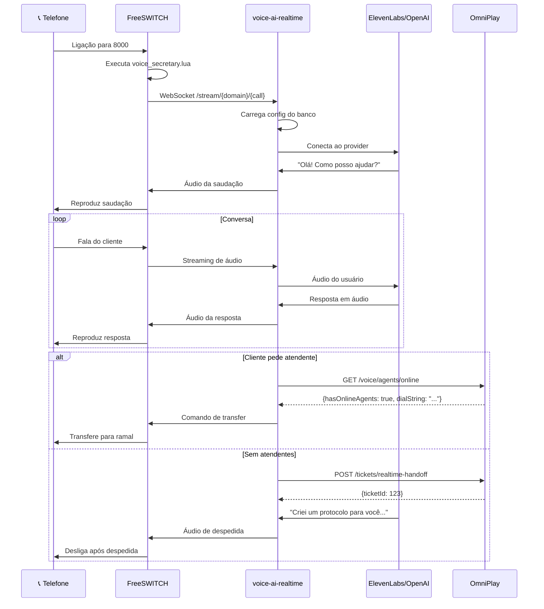

# 🎙️ Voice AI IVR - Sistema de Atendimento por Voz com IA

## Visão Geral

O **Voice AI IVR** é um sistema de atendimento telefônico inteligente que utiliza Inteligência Artificial para conduzir conversas naturais com clientes por voz. O sistema integra **FreeSWITCH** (central telefônica VoIP) com provedores de IA em tempo real como **ElevenLabs**, **OpenAI Realtime** e **Google Gemini Live**, permitindo que uma "secretária virtual" atenda chamadas, entenda o contexto, responda perguntas e, quando necessário, transfira para atendentes humanos ou crie tickets automaticamente.

---

## 🏗️ Arquitetura do Sistema

```
┌─────────────────────────────────────────────────────────────────────────────┐
│                              INFRAESTRUTURA                                  │
├─────────────────────────────────────────────────────────────────────────────┤
│                                                                              │
│  ┌──────────────┐     ┌──────────────────┐     ┌─────────────────────────┐  │
│  │   Telefone   │────▶│   FreeSWITCH     │────▶│   voice-ai-realtime    │  │
│  │   (SIP/PSTN) │     │   + FusionPBX    │     │   (Python WebSocket)   │  │
│  └──────────────┘     │   + mod_audio_   │     └──────────┬──────────────┘  │
│                       │     stream       │                 │                 │
│                       └──────────────────┘                 │                 │
│                                                            │                 │
│                       ┌────────────────────────────────────┼───────────────┐│
│                       │           AI Providers             │               ││
│                       │  ┌───────────────┐ ┌─────────────┐│               ││
│                       │  │  ElevenLabs   │ │   OpenAI    ││               ││
│                       │  │ Conversational│ │  Realtime   │◀───────────────┘│
│                       │  └───────────────┘ └─────────────┘│                 │
│                       │  ┌───────────────┐                 │                 │
│                       │  │ Google Gemini │                 │                 │
│                       │  │     Live      │                 │                 │
│                       │  └───────────────┘                 │                 │
│                       └────────────────────────────────────────────────────┘│
│                                                                              │
│  ┌──────────────────────────────────────────────────────────────────────┐   │
│  │                         OmniPlay Backend                              │   │
│  │  ┌────────────┐  ┌────────────────┐  ┌─────────────────────────────┐ │   │
│  │  │  Tickets   │  │ VoiceConversation │  │   AgentRoutingService   │ │   │
│  │  │  (pending) │  │    (histórico)    │  │   (atendentes online)   │ │   │
│  │  └────────────┘  └────────────────────┘  └─────────────────────────┘ │   │
│  └──────────────────────────────────────────────────────────────────────┘   │
│                                                                              │
│  ┌──────────────────────────────────────────────────────────────────────┐   │
│  │                      FusionPBX Application                            │   │
│  │  ┌─────────────┐  ┌─────────────┐  ┌──────────────┐  ┌────────────┐  │   │
│  │  │ Secretárias │  │  Providers  │  │ Transfer     │  │ Documentos │  │   │
│  │  │ Virtuais    │  │  (AI)       │  │ Rules        │  │ (RAG)      │  │   │
│  │  └─────────────┘  └─────────────┘  └──────────────┘  └────────────┘  │   │
│  └──────────────────────────────────────────────────────────────────────┘   │
└─────────────────────────────────────────────────────────────────────────────┘
```

---

## 🎯 O Que o Sistema Faz (Funcionalidades Atuais)

### 1. **Atendimento Automático por Voz com IA**

- **Conversa Natural**: A IA conduz conversas fluidas em português brasileiro, entendendo contexto e respondendo de forma natural
- **Modos de Processamento**:
  - **Turn-based (v1)**: STT → LLM → TTS tradicional, sequencial
  - **Realtime (v2)**: Streaming bidirecional de áudio, conversa natural sem pausas perceptíveis
  - **Auto**: Escolhe automaticamente o melhor modo

### 2. **Provedores de IA Suportados**

| Provedor | Tipo | Características |
|----------|------|-----------------|
| **ElevenLabs Conversational** | Realtime | Baixa latência (~300ms), vozes naturais em PT-BR, barge-in nativo |
| **OpenAI Realtime** | Realtime | Multi-modal (voz+texto), function calling avançado |
| **Google Gemini Live** | Realtime | Integração com Google Search, contexto longo |
| **OpenAI Whisper** | STT | Transcrição de alta qualidade |
| **Google Cloud STT** | STT | Português nativo, baixa latência |
| **ElevenLabs TTS** | TTS | Vozes clonadas, prosódia natural |
| **OpenAI TTS** | TTS | Várias vozes, rápido |

### 3. **Handoff Inteligente para Atendentes Humanos**

O sistema detecta quando o cliente precisa falar com um humano e:

1. **Detecção de Intenção**: Palavras-chave ("atendente", "humano", "falar com pessoa") ou número máximo de turnos
2. **Verificação de Disponibilidade**: Consulta atendentes online via WebRTC/SIP
3. **Transferência ou Fallback**:
   - ✅ **Atendentes online**: Transfere a chamada automaticamente
   - ❌ **Sem atendentes**: Cria ticket "pending" no OmniPlay com transcrição completa

### 4. **Integração com OmniPlay (Omnichannel)**

- **Criação de Tickets**: Quando não há atendentes, cria ticket com:
  - Transcrição completa da conversa
  - Resumo gerado pela IA
  - Gravação da chamada (opcional)
  - Metadados (duração, latência, provider)
- **Histórico de Conversas**: Todas as conversas são salvas em `VoiceConversation`
- **Multi-tenant**: Isolamento completo por `companyId`

### 5. **Transfer Rules Dinâmicas**

Regras configuráveis por departamento:

```
"Quero falar com vendas" → Transfere para ramal 201
"Preciso do suporte técnico" → Transfere para ramal 202
"Agendar com Dr. Carlos" → Transfere para ramal 305
```

### 6. **Verificação de Presença e Horário**

- **Verificação de Ramal**: Usa ESL para verificar se extensão está registrada/online
- **Business Hours**: Integração com Time Conditions do FusionPBX
- **Fallback Inteligente**: Fora do horário ou sem presença → cria ticket

### 7. **Métricas e Observabilidade**

- **Prometheus Metrics**: Latência, sessões ativas, chunks de áudio
- **Health Score**: Penaliza underruns e latência alta
- **Logs Estruturados**: JSON para análise em ELK/Grafana

---

## 🚀 O Que Pretendemos Fazer (Roadmap)

### Fase 1: Otimização de Latência (Q1 2026)
- [ ] Adaptive warmup baseado em histórico de jitter
- [ ] Predição de resposta para começar TTS antes
- [ ] Compressão Opus para streaming

### Fase 2: IA Avançada (Q2 2026)
- [ ] **RAG com Documentos**: Consultar PDFs, manuais, catálogos durante a conversa
- [ ] **Function Calling**: Agendar reuniões, consultar CRM, criar pedidos
- [ ] **Sentiment Analysis**: Detectar frustração e priorizar handoff
- [ ] **Voice Biometrics**: Identificar cliente pela voz

### Fase 3: Experiência Premium (Q3 2026)
- [ ] **Vozes Customizadas**: Clonar voz da empresa
- [ ] **Multi-idioma**: Detectar idioma e adaptar automaticamente
- [ ] **Fillers Naturais**: "Hmm", "Um momento" enquanto processa
- [ ] **Interrupção Inteligente**: Barge-in com contexto preservado

### Fase 4: Analytics e BI (Q4 2026)
- [ ] Dashboard de métricas por secretária
- [ ] Análise de sentimento agregada
- [ ] Relatórios de handoff e abandono
- [ ] A/B testing de prompts

---

## 📊 Fluxo de uma Chamada



---

## 🔧 Componentes do Sistema

### 1. **voice-ai-realtime** (Python)
- WebSocket server na porta 8085
- Bridge entre FreeSWITCH e AI providers
- Gerencia sessões, resampling, warmup
- Métricas Prometheus

### 2. **mod_audio_stream** (FreeSWITCH C module)
- Streaming bidirecional de áudio via WebSocket
- Suporta 16kHz PCM16 mono
- Playback binário (rawAudio) ou JSON (streamAudio)

### 3. **FusionPBX Application** (PHP)
- UI para configurar secretárias, providers, regras
- Multi-tenant por domain
- Integração com dialplan

### 4. **OmniPlay Backend** (Node.js/TypeScript)
- API REST para tickets e conversas
- AgentRoutingService para verificar atendentes
- VoiceHandoffService para criar tickets
- VoiceRecordingService para anexar gravações

### 5. **Lua Scripts** (FreeSWITCH)
- `voice_secretary.lua`: Orquestra a chamada
- `lib/presence.lua`: Verifica presença de ramais
- `lib/time_conditions.lua`: Verifica horário comercial

---

## 🏢 Multi-tenant

O sistema é **100% multi-tenant**:

| Componente | Isolamento |
|------------|------------|
| FusionPBX | `domain_uuid` |
| OmniPlay | `companyId` |
| Mapeamento | `v_voice_secretaries.omniplay_company_id` |

Cada tenant pode ter:
- Suas próprias secretárias virtuais
- Seus próprios providers de IA (chaves API separadas)
- Suas próprias regras de transfer
- Suas próprias filas de tickets

---

## 📈 Benefícios

### Para a Empresa
- **Redução de custos**: Menos atendentes para triagem inicial
- **Atendimento 24/7**: Sem horário comercial para receber chamadas
- **Qualidade consistente**: IA sempre segue o script e tom de voz
- **Dados ricos**: Transcrição de 100% das conversas

### Para o Cliente
- **Sem espera**: Atendimento imediato, sem fila
- **Conversa natural**: Não precisa "apertar 1 para vendas"
- **Resolução rápida**: IA pode responder dúvidas simples
- **Fallback humano**: Sempre pode pedir para falar com pessoa

### Para o Atendente
- **Contexto completo**: Recebe transcrição antes de atender
- **Menos chamadas triviais**: IA resolve dúvidas simples
- **Priorização**: Tickets classificados por urgência/sentimento

---

## 🔐 Segurança

- **Autenticação JWT**: Rotas protegidas por token
- **Service Token**: Comunicação máquina-a-máquina segura
- **Isolamento de dados**: Queries sempre filtram por tenant
- **Logs de auditoria**: Todas as ações são logadas
- **Sem armazenamento de chaves**: API keys criptografadas no banco

---

## 📚 Documentação Relacionada

- [`DEPLOY_INSTRUCTIONS.md`](./DEPLOY_INSTRUCTIONS.md) - Como instalar e configurar
- [`VOICE_AI_ARCHITECTURE.md`](./VOICE_AI_ARCHITECTURE.md) - Detalhes técnicos
- [`VOICE_AI_FAQ.md`](./VOICE_AI_FAQ.md) - Perguntas frequentes
- [`FUTURE_ENHANCEMENTS.md`](./FUTURE_ENHANCEMENTS.md) - Roadmap detalhado

---

## 📞 Contato

Para dúvidas sobre o sistema Voice AI IVR, consulte a equipe de desenvolvimento OmniPlay.

---

*Última atualização: Janeiro 2026*
